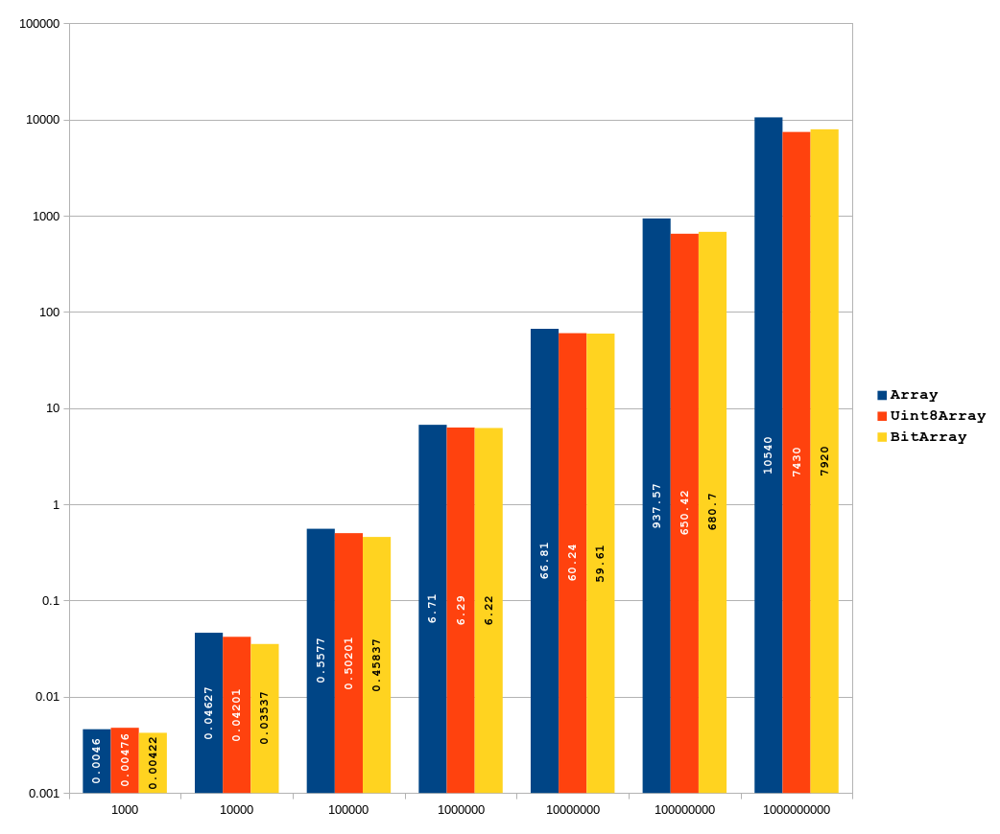

# **BitArray**

Written by [Redu](https://stackoverflow.com/users/4543207/redu), with contributions by [Atriace](https://stackoverflow.com/users/923972/atriace) due to the question of ["How do I create a bit array in JavaScript"](https://stackoverflow.com/questions/6972717/how-do-i-create-bit-array-in-javascript/73993403#answer-73993403).

This is a JavaScript class implementation of a BitArray extending [DataView](https://developer.mozilla.org/en-US/docs/Web/JavaScript/Reference/Global_Objects/DataView).  It implements bit masks to access the bits which are technically stored as `Bytes` in the `DataView`.  Conveniently, it also offers [standard boolean operations](https://en.wikipedia.org/wiki/Bit_array#Basic_operations).

### **Benefits of BitArray**

- `BitArray` is developed with a performance first approach in mind. While indexed operations `.at(i)`, `.reset(i)`, `.set(i)` and `.toggle(i)` are expected to be slightly slower than `Uint8Array` or `Int8Array` when other operations are concerned, `BitArray` is many times faster or in par with `TypedArray`s and `Array`s. Accordingly an algorithm using a mix of both indexed and other operations may yield an overall higher performance.

- The memory footprint of `BitArray` is much smaller than any other type of arrays having the same number of elements.
- Since `BitArray` extends `DataView`, all inherited methods like `.getUint32()` or `.setUint8()` etc. are available to `BitArray`s.

### **Constructor:** *BitArray(sizeOrBuffer)*

* **`sizeOrBuffer`**: Either a pre-existing [`ArrayBuffer`](https://developer.mozilla.org/en-US/docs/Web/JavaScript/Reference/Global_Objects/ArrayBuffer) or a positive integer [`Number`](https://developer.mozilla.org/en-US/docs/Web/JavaScript/Reference/Global_Objects/Number). In order to be able to deliver best performance, except for the indexed ones all properties or methods such as `.popcnt`, `.all()`, `.clear()`, `.and()` etc. use 32 bit access to the underlying `ArrayBuffer`. Accordingly the `BitArray.buffer.byteLength` is always set to minimum multiples of 4 that is equal to or greater than the requested integer size. In case `sizeOrBuffer` is of `ArrayBuffer` type and it's `byteLength` is not a multiple of 4 then a new `ArrayBuffer` is generated in minimal correct size and the provided `ArrayBuffer` gets copied at it's head. In theory `BitArray` should allow sizes up to 34,359,738,336 (`0x07ffffffe0`).

### **Syntax**

```javascript
new BitArray(buffer);
new BitArray(number);
```

### **Examples**

Starting with something simple...

```javascript
var a = new BitArray(10);
a.set(0);
a.set(3);

console.log(`${a}`); // 10010000000000000000000000000000
a.length;            // 32
a.size;              // 10
a.popcnt;            // 2
```

### **Static Methods**
* **`BitArray.from()`**: Converts either an `Array` with `unknown[]` type or an `ArrayBufferView` type according to the elements being truthy or falsey. The `length` of the constructed `BitArray` is adjusted according to the rule mentioned above.
* **`BitArray.isBitArray()`**: Returns `true` if the provided argument is of `BitArray` type.
* **`BitArray.isConvertable()`**: Returns `true` if the provided argument is either a `BitArray` or an `ArrayBufferView` type.

### **Properties**
* **`length`**: An immutable property returning the actual length of the `BitArray`. All operations are performed up to the `length` by the exception of convertions back to `Array`s or `TypedArrays` which are done up to the `size` as explained below.
* **`popcnt`**: Returns the total number of 1s in the `BitArray`.
* **`size`**: An immutable property returning the requested size at construction time. Although you may set bits beyond the `size` value up to the `length` any convertions back to `Array`s or `TypedArray`s are limited to the `size` property value. Accordingly if you intend to make such convertions then it would be wise to not populate the `BitArray` beyond it's `size`.
### **Methods**
#### Tests
* **`.all()`**: Returns `true` if all bits in the `BitArray` are set.

```javascript
var a = new BitArray(10);
a.fill();  // 11111111111111111111111111111111
a.all();   // true
a.reset(7);// 11111110111111111111111111111111
a.all();   // false 
```

* **`.any()`**: Returns `true` if any of the bits in the `BitArray` are set. If returns `false` then all bits are 0.

```javascript
var a = new BitArray(10);
a.any();   // false
a.set(7);  // 00000001000000000000000000000000
a.any();   // true 
```

* **`.isEqual()`**: Returns `true` if tested `BitArray`s have the same bits set.

```javascript
var a = new BitArray(10),
    b;
a.randomize(); // 10001111001101010101001100111100
b = a.slice(); // 10001111001101010101001100111100
a.isEqual(b);  // true 
```

#### Logical Operators
* **`.and(bar, inPlace = false)`**: And of `this` and `bar`. Example: 1100 & 1001 = 1000. If `inPlace` is set to `true` then the operation is performed in place (`this` holds the result).

```javascript
var a = new BitArray(10),
    b = new BitArray(37),
    c;

a.length;  // 32
a.size;    // 10
b.length;  // 64
b.size;    // 37

a.set(7);  // 00000001000000000000000000000000
a.set(8);  // 00000001100000000000000000000000
b.set(8);  // 0000000010000000000000000000000000000000000000000000000000000000

a.and(b);  // 00000001000000000000000000000000
b.and(a);  // 0000000100000000000000000000000000000000000000000000000000000000
```

* **`.not(inPlace = false)`**: Flips all the bits in this buffer. Example: 1100 = 0011. If `inPlace` is set to `true` then the operation is performed in place (`this` holds the result).
* **`.or(bar, inPlace = false)`**: Or of this and bar. Example: 1100 & 1001 = 1101. If `inPlace` is set to `true` then the operation is performed in place (`this` holds the result).
* **`.xor(bar, inPlace = false)`**: Xor of this and bar. Example: 1100 & 1001 = 0101. If `inPlace` is set to `true` then the operation is performed in place (`this` holds the result).
#### Modifiers
* **`.clear()`**: Resets the `BitArray` in place.
* **`.fill()`**: Sets the `BitArray` in place.
* **`.randomize()`**: Sets or resets every bit in the `BitArray` randomly in place
* **`.reset(i)`**: Resets the value at given index `i`.
* **`.set(i)`**: Sets the value at given index `i`.
* **`.toggle(i)`**: Flips the value at given index `i`.
#### Others
* **`.slice(a = 0, b = this.buffer.byteLength)`**: Slices `BitArray` and returns a new `BitArray` with `buffer.byteLength` in multiples of 4 bytes (32 bits). Pay attention that the arguments are in **byte** unit. When invoked with no arguments, the default argument values instantiate a clone.
* **`.toString()`**: Returns the string representation of the `BitArray`.
### **Converting from a BitArray into an Array or TypedArray**
Since `BitArray` is an iterable object, converting it into an `Array` is easily achieved by the spread operator. Conversion into `TypeArrays` is done by the `TypedArray.from(BitArray)` method as follows...

```javascript
var a = new BitArray(10),
    b,
    c;
a.set(0);
a.set(3);

console.log(`${a}`);    // 10010000000000000000000000000000
a.length;               // 32

b = [...a];             // [1,0,0,1,0,0,0,0,0,0,0,0,0,0,0,0,0,0,0,0,0,0,0,0,0,0,0,0,0,0,0,0,]
c = Uint8Array.from(a); // Uint8Array(32) [1,0,0,1,0,0,0,0,0,0,0,0,0,0,0,0,0,0,0,0,0,0,0,0,0,0,0,0,0,0,0,0, buffer: ArrayBuffer(32), byteLength: 32, byteOffset: 0, length: 32, Symbol(Symbol.toStringTag): 'Uint8Array']
```

### **Using DataView Access**
Since `BitArray` is just an extension of the `DataView` object, all of it's methods are inherited and at your service for free. However remember that, while reading or manipulating a `BitArray`'s `ArrayBuffer` through the inherited methods you should use byte indexed access.


### **Benchmarks**

We bench a meaningful usecase of `BitArray` employed in an Optimized Segmented Sieve of Sundaram based single threaded `PI` function which returns the count of prime numbers up to a number `n`. Tests are run for `0` to different `n` values from 1000 to 1,000,000,000 both for `Array`, `BitArray` and `Uint8Array`. Benchmarking is done by Deno's built in benchmarking tool. So just run

**`/path-to-project$`** `deno bench --unstable`

at the root of the project to see it for yourself.

N| Array (ms) | Uint8Array (ms) | BitArray (ms)
-|-------|------------|---------
1000 | 0.0046 | 0.00476 | 0.00422
10000 | 0.04627 | 0.04201 | 0.03537
100000 | 0.5577 | 0.50201 | 0.45837
1000000 | 6.71 | 6.29 | 6.22
10000000 | 66.81 | 60.24 | 59.61
100000000 | 937.57 | 650.42 | 680.7
1000000000 | 10540 | 7430 | 7920



Keep in mind that both axis are in logaritmic scale. Although the length of the bars seems to be close, `Array` performs  very bad especially when the size exceeds 33,554,433 limit (> 2²⁵) at which point `Array` reaches to ~268MB memory limit and it's internal structure gets switched to `NumberDictionary[16]` yielding a dramatic slowdown of the V8 engine. `BitArray` and `Uint8Array` don't get effected from this phenomenon. In fact `BitArray` should be using only ~4MB of memory at this point.

As seen from the above data and chart `BitArray` is faster or in par with `Uint8Array`. Besides we have to remember that `BitArray` has 1/8 of the memory footprint of an `Uint8Array`.

### **TODO**
* With hopes to improve the performance of `BitArray` further, in the upcoming version I plan to include a WASM module to kick in after a certain size.